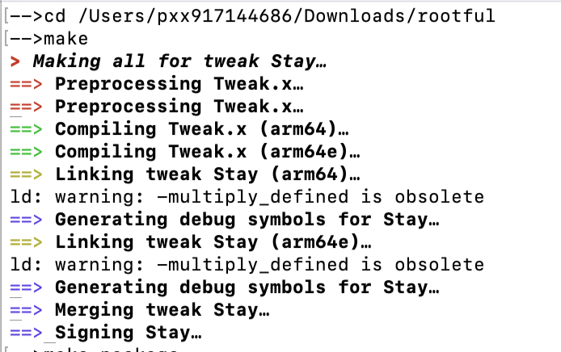
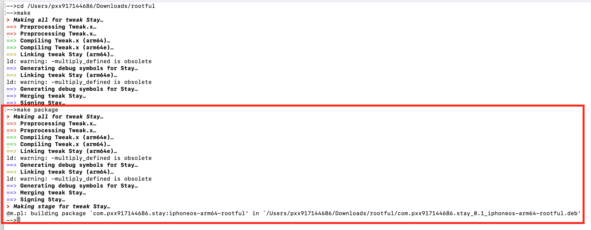
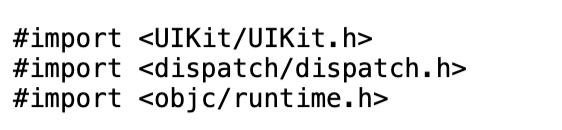

<table>
<tr>
<td>


</td>
<td>

```js
克隆 Theos 仓库
git clone --recursive https://github.com/theos/theos.git

将 Theos 的路径添加到环境变量中：
export THEOS=~/theos
export PATH=$THEOS/bin:$PATH

重新加载配置：
source ~/.zshrc
```

</td>
</tr>
</table>

</details>

// Theos 编译为 .dylib 文件
<details>
<summary> 👉  make </summary>

[)
</details> 

// Theos 编译打包成一个 .deb 安装包
<details>
<summary> 👉  make package </summary>

[)
</details>


<h1 align="center">
  <br>
  关于. `（Tweak）核心代码 `
</h1>


## 目录 - 简单的概括

结合了 UIKit、GCD（Grand Central Dispatch）和 运行时编程，利用 Theos 框架中的钩子方法。

---

| **方法**                | **解释**                                                      |
|-------------------------|-------------------------------------------------------------|
| **`#import <UIKit/UIKit.h>`**  | 导入 UIKit 框架，用于 UI 处理。                             |
| **`#import <dispatch/dispatch.h>`** | 导入 GCD 框架，用于异步和延迟执行。                           |
| **`#import <objc/runtime.h>`** | 导入运行时库，用于动态操作类和对象。                              |
| **`InitFunc_0()`**      | 设置了一个延迟任务，在 1 秒后在主线程执行 **`sub_7E6C()`** 函数。      |
| **`sub_7E6C()`**        | 动态获取 **`STUser`** 类，通过运行时机制调用 **`current`** 方法获取当前用户，并尝试调用 **`setPlan:`** 方法。 |
| **`%ctor`**             | 让 **`InitFunc_0`** 在程序启动时自动执行。                       |
| **`%hook STUser`**      | 对 **`STUser`** 类进行钩子操作。                                 |

---


## 关于. `Objective-C 的头文件引用` 



---

| **方法**                            | **解释**                                                                                     |
|-------------------------------------|----------------------------------------------------------------------------------------------|
| **`#import <UIKit/UIKit.h>`**       | 这是一个常见的头文件引用。UIKit 是一个非常重要的 iOS 开发框架，包含了所有 UI 相关的功能，例如界面组件（如按钮、标签、文本框等）、视图管理、动画、用户交互。 |
| **`#import <dispatch/dispatch.h>`**  | 这是导入 GCD（Grand Central Dispatch）框架的头文件。GCD 是苹果提供的一种多线程技术，用来高效地处理并发任务。在 iOS 和 macOS 中，GCD 是一个常用的工具，用来简化并发编程，提升应用的性能。 |
| **`#import <objc/runtime.h>`**      | 这是导入 Objective-C 运行时的头文件。在 iOS 或 macOS 中，运行时可以用来做很多高级操作，比如动态添加方法、交换方法实现、查询类信息等。 |

---


## 关于 `void sub_7E6C(void);`
```bash
void sub_7E6C(void);
```
下面是对 `void sub_7E6C(void);` 函数声明的简要解释。

---

| **方法**                   | **解释**                                                                 |
|----------------------------|--------------------------------------------------------------------------|
| **`void sub_7E6C(void);`**  | 声明一个函数，但没有定义具体内容。该声明可能在后续代码中有具体实现。  |
| **作用**                    | 该声明用于告知编译器该函数的存在，便于在后续代码中调用。通常用于自定义函数，并可能在后续执行特定操作。 |

---


## 关于 `void InitFunc_0() { ... }`
```bash
void InitFunc_0() {
    dispatch_time_t when = dispatch_time(DISPATCH_TIME_NOW, (int64_t)(1.0 * NSEC_PER_SEC));
    dispatch_after(when, dispatch_get_main_queue(), ^{
        NSLog(@"InitFunc_0 executed block on main queue");
        sub_7E6C();
    });
}
```
下面是对 `InitFunc_0` 函数的详细说明。

---

| **方法**                           | **解释**                                                                                     |
|------------------------------------|----------------------------------------------------------------------------------------------|
| **`void InitFunc_0() { ... }`**    | `InitFunc_0` 是一个自定义函数，执行了一个延迟任务，并在主线程上执行一个 block。               |
| **`dispatch_time_t when = dispatch_time(DISPATCH_TIME_NOW, (int64_t)(1.0 * NSEC_PER_SEC));`** | 使用 GCD 设置一个延迟时间为 1 秒，`dispatch_time` 用来计算延迟时间。                                |
| **`dispatch_after(when, dispatch_get_main_queue(), ^{ ... });`** | 将一个任务排入主队列，延迟 1 秒后执行该任务。                                                   |
| **`dispatch_get_main_queue()`**     | 表示将代码放到主线程（UI线程）执行。                                                            |
| **`NSLog(@"InitFunc_0 executed block on main queue");`** | 在主线程输出日志，表示延迟任务已执行。                                                           |
| **`sub_7E6C()`**                   | 在 1 秒钟后，`InitFunc_0` 在主线程执行 block 时会调用 `sub_7E6C()` 函数。                          |

---


## 关于 `void sub_7E6C() { ... }`
```bash
void sub_7E6C() {
    Class STUserClass = objc_getClass("STUser");
    if (STUserClass) {
        id currentUser = [STUserClass performSelector:@selector(current)];
        if (currentUser) {
            [currentUser performSelector:@selector(setPlan:) withObject:nil];
            NSLog(@"Called setPlan: on STUser");
        } else {
            NSLog(@"STUser current returned nil");
        }
    } else {
        NSLog(@"STUser class not found");
    }
}
```
下面是对 `sub_7E6C` 函数的详细解释。

---

| **方法**                                         | **解释**                                                                                      |
|--------------------------------------------------|-----------------------------------------------------------------------------------------------|
| **`void sub_7E6C() { ... }`**                    | `sub_7E6C` 是一个自定义函数，用来检查是否存在 `STUser` 类，并动态调用其方法。                  |
| **`Class STUserClass = objc_getClass("STUser");`** | 使用运行时 API 获取名为 `STUser` 的类。`objc_getClass` 是运行时函数，根据字符串名称返回类引用。    |
| **`if (STUserClass)`**                           | 检查 `STUser` 类是否存在。如果类存在，继续执行后续代码。                                      |
| **`id currentUser = [STUserClass performSelector:@selector(current)];`** | 动态消息发送，调用 `STUser` 类的 `current` 方法，返回当前用户对象。                             |
| **`if (currentUser)`**                           | 如果 `currentUser` 不为 `nil`，执行后续操作。                                                 |
| **`[currentUser performSelector:@selector(setPlan:) withObject:nil];`** | 调用 `currentUser` 的 `setPlan:` 方法，传递 `nil` 作为参数。`setPlan:` 是设置用户计划的 setter 方法。 |
| **`NSLog(@"Called setPlan: on STUser");`**       | 如果成功调用 `setPlan:` 方法，输出日志，表示调用成功。                                        |
| **`NSLog(@"STUser current returned nil");`**     | 如果 `currentUser` 为 `nil`，输出日志，表示 `current` 方法返回了 `nil`。                        |
| **`NSLog(@"STUser class not found");`**          | 如果 `STUser` 类不存在，输出日志。                                            |

---


## 关于 `%ctor { InitFunc_0(); }`
```bash
%ctor {
    InitFunc_0();
}
```
作用：当 APP 启动时，`InitFunc_0` 会被调用，通过构造函数机制触发延时任务，1 秒后执行主线程中的 block。
下面是对 `%ctor { InitFunc_0(); }` 的详细解释。

---

| **方法**                             | **解释**                                                                                               |
|--------------------------------------|--------------------------------------------------------------------------------------------------------|
| **`%ctor { InitFunc_0(); }`**        | `%ctor` 是 Theos 环境中特有的构造函数语法，表示在某个对象或类被加载时，自动执行其中的代码。            |
| **`InitFunc_0();`**                  | 调用 `InitFunc_0` 函数，`InitFunc_0` 会设置一个延时任务（1 秒后执行），并触发该任务。                    |


---


## 关于 `%hook STUser`
```bash
%hook STUser
%end
```
作用：这段代码用来钩住或拦截 `STUser` 类的方法，可以在其中进行自定义修改。 
下面是对 `%hook STUser` 的详细解释。

---

| **方法**                            | **解释**                                                                                     |
|-------------------------------------|----------------------------------------------------------------------------------------------|
| **`%hook STUser`**                  | 使用 Theos 特有的语法进行钩子操作，表示对 `STUser` 类进行修改或拦截其方法。                        |
| **`%end`**                          | 结束钩子操作，标志着钩子代码的范围，告诉系统该类的钩子操作已结束。                              |


---
